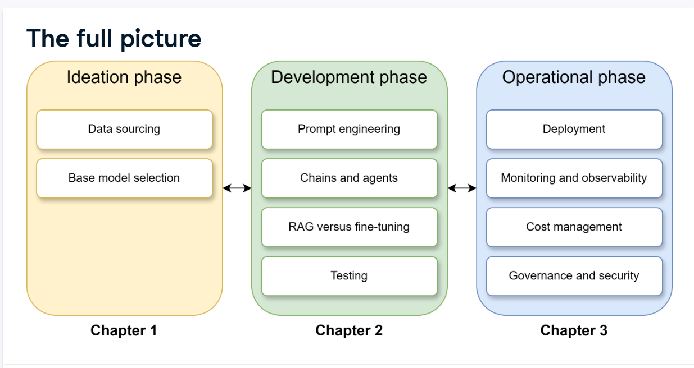

# LLMOps — Lifecycle Guide (Ideation → Development → Operations)

This page follows a simple, three-phase view of LLMOps shown in the diagram below. Use it as a neutral reference that explains what each phase covers and the practical tasks you'll perform in each.

---

## Phase 1 — Ideation

Purpose: decide whether and how an LLM adds value for the problem you want to solve.

- Data sourcing: identify the documents, APIs, or streams you will rely on. Consider privacy, licensing, and labeling effort up front.
- Base model selection: choose hosted APIs vs open weights vs fine-tuning. Balance cost, latency, governance, and control. Small models are cheaper and useful for filters; larger models are useful for generation and reasoning.

Why it matters: a clear problem definition and known data sources reduce wasted effort later. Document these decisions so future teams understand the trade-offs.

---

## Phase 2 — Development

Purpose: build a reliable, testable prototype that demonstrates the approach and meets baseline success criteria.

- Prompt engineering: iterate prompts, system messages, and examples to shape desired outputs. Treat prompts like config and version them.
- Chains and agents: for multi-step workflows, design chains (pipeline of calls) or agents (components that take actions). Keep control flow explicit and testable.
- RAG vs fine-tuning: decide whether to use retrieval-augmented generation (RAG) to surface context or to fine-tune models on domain data. RAG is faster to iterate and avoids heavyweight retraining; fine-tuning can give higher accuracy but increases maintenance.
- Testing: build unit tests for deterministic parts and human-in-the-loop or rubric-based tests for generative outputs. Create failure-mode tests (hallucinations, safety violations).

Why it matters: development is where you reduce tail risk — test the pieces, measure costs, and instrument the system so you can observe behavior under load.

---

## Phase 3 — Operational

Purpose: run the system safely, reliably, and within cost and compliance constraints.

- Deployment: choose serving modes (sync API, streaming, batch) and implement caching, batching, and retries.
- Monitoring and observability: collect prompt/response samples, latency, token counts, error rates, and metrics that reflect user-facing quality.
- Cost management: track token usage, set budgets and rate limits, and prefer cheaper models for low-risk paths.
- Governance and security: manage secrets, audit logs, PII controls, and model-change approvals.

Why it matters: operations keep the system predictable. Focus on SLOs, alerting for degradation, and a feedback loop that surfaces real user problems back to development.

---

## Short checklist (per-phase)

- Ideation: document problem statement, data sources, and chosen baseline model.
- Development: version prompts, add tests, and instrument runtime metrics.
- Operations: set SLOs, enable monitoring, and enforce cost limits.
